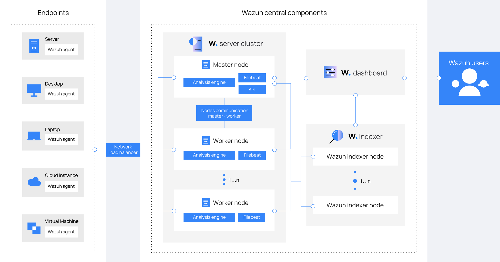
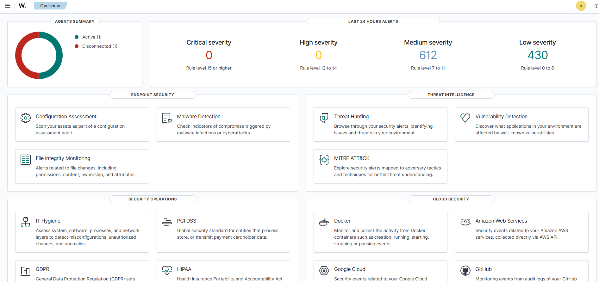

Complete beginner-friendly guide to install Wazuh SIEM server on Ubuntu and configure Sysmon on Windows agents for SOC-grade security monitoring.

> **Who is this for?** Beginners and IT administrators setting up Wazuh for the first time on a physical, virtual, or cloud Ubuntu server.

---

## Table of Contents

- [Part 1 — Wazuh Server Setup](#part-1--wazuh-server-setup-ubuntu)
  - [What Is Wazuh?](#what-is-wazuh)
  - [Prerequisites](#prerequisites)
  - [Step 1: Check Your OS Version](#step-1-check-your-os-version)
  - [Step 2: Update the System](#step-2-update-the-system-and-free-port-443)
  - [Step 3: Set the Server Hostname](#step-3-set-the-server-hostname-optional)
  - [Step 4: Check Available RAM](#step-4-check-available-ram)
  - [Step 5: Configure Firewall](#step-5-configure-firewall-ports)
  - [Step 6: Install Required Packages](#step-6-install-required-packages)
  - [Step 7: Download the Installer](#step-7-download-the-wazuh-installer-script)
  - [Step 8: Run the Installation](#step-8-run-the-all-in-one-wazuh-installation)
  - [Step 9: Recover Admin Password](#step-9-recover-the-admin-password-if-you-missed-it)
  - [Step 10: Verify Services](#step-10-verify-all-services-are-running)
  - [Step 11: Access the Dashboard](#step-11-access-the-wazuh-dashboard)
  - [Step 12: Tune JVM Heap](#step-12-tune-jvm-heap-for-low-ram-servers-if-needed)
  - [Step 13: Enroll a Windows Agent](#step-13-enroll-a-wazuh-agent-windows)
  - [Step 14: Enroll a Linux Agent](#step-14-enroll-a-wazuh-agent-linux)
  - [Troubleshooting](#troubleshooting)
- [Part 2 — Sysmon Setup on Windows](#part-2--sysmon-setup-on-windows)
  - [What Is Sysmon?](#what-is-sysmon-and-why-do-you-need-it)
  - [Step 1: Download Sysmon](#step-1-download-sysmon)
  - [Step 2: Download Config File](#step-2-download-a-sysmon-configuration-file)
  - [Step 3: Organize Files](#step-3-organize-the-files)
  - [Step 4: Install Sysmon](#step-4-install-sysmon)
  - [Step 5: Verify Sysmon](#step-5-verify-sysmon-is-running)
  - [Step 6: Verify Logs](#step-6-verify-sysmon-logs-are-being-generated)
  - [Step 7: Generate a Test Event](#step-7-generate-a-test-event)
  - [Step 8: Confirm Wazuh Agent](#step-8-confirm-the-wazuh-agent-is-installed)
  - [Step 9: Configure Agent to Read Sysmon](#step-9-configure-the-wazuh-agent-to-read-sysmon-logs)
  - [Step 10: Restart Wazuh Agent](#step-10-restart-the-wazuh-agent)
  - [Step 11: Verify in Dashboard](#step-11-verify-sysmon-events-are-arriving-in-the-dashboard)

---

## Part 1 — Wazuh Server Setup (Ubuntu)

### What Is Wazuh?


Wazuh is a free, open-source security platform that combines:

- **Endpoint protection** — monitors Windows, Linux, and macOS machines
- **SIEM** — Security Information and Event Management
- **Log analysis** — collects and parses logs from all agents
- **File integrity monitoring** — detects unauthorized file changes
- **Vulnerability detection** — flags known CVEs on enrolled machines

By the end of this guide, you will have:

| Component | Port | Purpose |
|---|---|---|
| Wazuh Manager | 1514 | Listens for agent events |
| Wazuh Indexer (OpenSearch) | 9200 | Stores all alerts |
| Filebeat | — | Forwards alerts to the indexer |
| Wazuh Dashboard | 443 | Web UI (HTTPS) |

---

### Prerequisites

**Hardware requirements (official):**

| Component | Minimum RAM | Minimum CPU | Recommended RAM | Recommended CPU |
|---|---|---|---|---|
| Wazuh Server (all-in-one) | 2 GB | 2 cores | 4 GB | 8 cores |

**Disk space per agent (90 days of alerts):**
- Servers: ~0.1 GB per agent
- Workstations: ~0.04 GB per agent
- Network devices: ~0.2 GB per agent

> **Example:** 80 workstations + 10 servers + 10 network devices ≈ **6 GB** for 90 days of alerts.

**Officially supported operating systems:**

| OS | Supported Versions |
|---|---|
| Ubuntu | 16.04, 18.04, 20.04, 22.04, 24.04 |
| Red Hat Enterprise Linux (RHEL) | 7, 8, 9, 10 |
| CentOS Stream | 10 |
| Amazon Linux | Amazon Linux 2, Amazon Linux 2023 |

> This guide uses **Ubuntu** for all commands. On RHEL/CentOS/Amazon Linux, the `wazuh-install.sh` script works identically — only system update commands differ (`yum` or `dnf` instead of `apt`).

**Required ports — must be free and reachable:**

| Port | Protocol | Purpose |
|---|---|---|
| 443 | TCP | Wazuh Dashboard (HTTPS) |
| 1514 | TCP/UDP | Agent event communication |
| 1515 | TCP | Agent auto-enrollment |
| 9200 | TCP | Wazuh Indexer REST API (localhost only) |
| 55000 | TCP | Wazuh Manager REST API |

> **Critical:** If Apache, Nginx, or any other web server is running on port 443, the Wazuh dashboard will fail to start. Stop them before proceeding (covered in Step 2).

---

### Step 1: Check Your OS Version

Confirm your server is running a supported OS version.

```bash
lsb_release -a
```

Expected output (Ubuntu 22.04 example):

```
No LSB modules are available.
Distributor ID: Ubuntu
Description:    Ubuntu 22.04.4 LTS
Release:        22.04
Codename:       jammy
```

> On RHEL: `cat /etc/redhat-release`  
> On Amazon Linux: `cat /etc/os-release`

---

### Step 2: Update the System and Free Port 443

Update your system to get the latest security patches and ensure package dependencies resolve correctly.

```bash
sudo apt update && sudo apt upgrade -y
```

Check if port 443 is already in use:

```bash
sudo ss -tlnp | grep ':443'
```

If you see `apache2`, `nginx`, or `caddy` in the output, stop them:

```bash
sudo systemctl stop apache2 nginx 2>/dev/null
sudo systemctl disable apache2 nginx 2>/dev/null
```

> If you see no output from the port check, port 443 is free and you are good to continue.

---

### Step 3: Set the Server Hostname (Optional)

Setting a proper hostname makes it easier to identify your server in logs and dashboards.

```bash
sudo hostnamectl set-hostname wazuh-server
```

Verify:

```bash
hostname
```

Expected output:

```
wazuh-server
```

---

### Step 4: Check Available RAM

```bash
free -h
```

Expected output example:

```
               total        used        free
Mem:           7.8Gi       1.2Gi       6.6Gi
```

| Available RAM | Status | Notes |
|---|---|---|
| Less than 2 GB | Not supported | Indexer will fail to start |
| 2–4 GB | Minimum | Tune JVM heap after install (Step 12) |
| 4 GB or more | Recommended | Suitable for production use |

---

### Step 5: Configure Firewall Ports

#### For Practice / Lab Environments

The easiest approach is to disable UFW entirely:

```bash
sudo ufw disable
```

Verify it is off:

```bash
sudo ufw status
```

Expected output:

```
Status: inactive
```

All ports are now open and Wazuh will work without any firewall configuration.

#### For AWS EC2 (Practice Setup)

Set your Security Group inbound rule to **All traffic → Source: Anywhere (0.0.0.0/0)**.

```
AWS Console → EC2 → Security Groups → Your Instance's Security Group
→ Inbound Rules → Edit → Add Rule
→ Type: All traffic
→ Source: Anywhere IPv4 (0.0.0.0/0)
→ Save
```

> **Production only:** For production use, open only the specific ports listed in Prerequisites and restrict source IPs to trusted ranges.

<details>
<summary>Production UFW configuration (click to expand)</summary>

<pre><code>
sudo ufw allow 22/tcp
sudo ufw allow 443/tcp
sudo ufw allow 1514/tcp
sudo ufw allow 1514/udp
sudo ufw allow 1515/tcp
sudo ufw allow 55000/tcp
sudo ufw reload
</code></pre>

</details>

---

### Step 6: Install Required Packages

```bash
sudo apt install -y curl unzip wget
```

---

### Step 7: Download the Wazuh Installer Script

Wazuh provides an official `wazuh-install.sh` script that automates everything: APT repository setup, package installation, TLS certificate generation, service startup, and security index bootstrap.

```bash
cd /root
curl -sO https://packages.wazuh.com/4.14/wazuh-install.sh
```

Verify the file was downloaded:

```bash
ls -lh wazuh-install.sh
```

Expected output:

```
-rw-r--r-- 1 root root 195K Apr 18 22:45 wazuh-install.sh
```

> If you get a 404 error, the version in the URL may have changed. Check [packages.wazuh.com](https://documentation.wazuh.com/current/installation-guide/wazuh-server/installation-assistant.html) for the latest version (e.g. `4.14`, `4.15`) and update the URL accordingly.

---

### Step 8: Run the All-in-One Wazuh Installation

The `-a` flag installs all four components on this single host: Wazuh Manager, Wazuh Indexer, Filebeat, and Wazuh Dashboard.

```bash
sudo bash wazuh-install.sh -a 2>&1 | tee /tmp/wazuh-install.log
```

> `2>&1` combines stdout and stderr so nothing is missed. `tee /tmp/wazuh-install.log` shows output on screen AND saves it to a log file for review if something goes wrong.

The installation takes **10–15 minutes**. Do not interrupt or close the terminal.

When it finishes successfully, you will see:

```
INFO: --- Summary ---
INFO: You can access the web interface https://<your-server-ip>
    User: admin
    Password: <GENERATED_PASSWORD>
INFO: Installation finished.
```

> **Copy the generated password immediately.** If you miss it, recover it using the command in Step 9.

---

### Step 9: Recover the Admin Password (If You Missed It)

**Option 1 — Single command (quickest):**

```bash
sudo tar -O -xvf wazuh-install-files.tar wazuh-install-files/wazuh-passwords.txt
```

**Option 2 — Extract to a folder first, then read:**

```bash
sudo tar -xf /root/wazuh-install-files.tar -C /tmp/
sudo head -10 /tmp/wazuh-install-files/wazuh-passwords.txt
```

Look for the `admin` entry:

```
# Admin user for the web interface and Wazuh indexer
  indexer_username: 'admin'
  indexer_password: 'YourGeneratedPasswordHere'
```

> Keep the full `wazuh-install-files.tar` file. It contains the root CA and component certificates — needed if you later add a second indexer node or regenerate certificates.

---

### Step 10: Verify All Services Are Running

```bash
sudo systemctl is-active wazuh-manager wazuh-indexer wazuh-dashboard filebeat
```

Expected output — all four should show `active`:

```
active
active
active
active
```

> If any service shows `inactive` or `failed`: `sudo journalctl -u wazuh-manager --no-pager | tail -20`

Verify ports are listening:

```bash
sudo ss -tlnp | grep -E ':443|:1514|:55000|:9200'
```

> The indexer (9200) only binds to `127.0.0.1` — this is intentional. Do not expose port 9200 to the network.

---

### Step 11: Access the Wazuh Dashboard

Open a browser and go to:

```
https://<your-server-ip>:443
```


> The dashboard uses a self-signed SSL certificate. Your browser will show a security warning — click **Advanced → Proceed** to continue. This is expected on first visit.

Log in with:
- **Username:** `admin`
- **Password:** The generated password from Step 8 or 9

After login, you will land on the Wazuh overview dashboard. It will show empty panels until the first agent is enrolled.

**Change the admin password after first login (if needed):**

Go to: `Security → Internal Users → admin → Edit → Set new password`

Or via CLI:

```bash
sudo /usr/share/wazuh-indexer/plugins/opensearch-security/tools/wazuh-passwords-tool.sh \
  -u admin -p 'YourNewStrongPassword@2026'
```

---

### Step 12: Tune JVM Heap for Low-RAM Servers (If Needed)

The installer sets the indexer JVM heap to 4 GB by default. On a server with exactly 4 GB RAM, this leaves almost no memory for the OS.

```bash
sudo nano /etc/wazuh-indexer/jvm.options
```

Find the `-Xms` and `-Xmx` lines and set them to half your total RAM:

| Server RAM | Recommended Heap Setting |
|---|---|
| 4 GB | `-Xms1g` and `-Xmx1g` |
| 8 GB | `-Xms4g` and `-Xmx4g` (default) |
| 16 GB+ | `-Xms8g` and `-Xmx8g` |

Restart the indexer after editing:

```bash
sudo systemctl restart wazuh-indexer
sudo systemctl status wazuh-indexer --no-pager | head -6
```

---

### Step 13: Enroll a Wazuh Agent (Windows)

On the **Wazuh Dashboard**, go to **Agent Summary → Deploy New Agent**.

Select:
- OS: **Windows**
- Server address: Your Wazuh server IP (e.g. `192.168.1.50`)
- Agent name: Optional (e.g. `Windows-PC1`)

Copy the generated PowerShell command and run it as **Administrator** on the Windows machine.

Template command (replace the IP):

```powershell
Invoke-WebRequest -Uri https://packages.wazuh.com/4.x/windows/wazuh-agent-4.8.0-1.msi -OutFile $env:TEMP\wazuh-agent.msi
msiexec.exe /i $env:TEMP\wazuh-agent.msi /q WAZUH_MANAGER='<WAZUH_SERVER_IP>' WAZUH_AGENT_NAME='Windows-PC1'
NET START WazuhSvc
```

The agent should appear with a green **Active** status in the dashboard within 1–2 minutes.

---

### Step 14: Enroll a Wazuh Agent (Linux)

On the **Wazuh Dashboard**, go to **Agent Summary → Deploy New Agent**.

Select:
- OS: **Linux (DEB)** for Ubuntu/Debian or **Linux (RPM)** for RHEL/CentOS
- Server address: Your Wazuh server IP
- Agent name: Optional (e.g. `Ubuntu-PC1`)

Copy the generated command and run it on the Linux machine as **root or sudo**.

Example generated command (Ubuntu/Debian):

```bash
curl -s https://packages.wazuh.com/key/GPG-KEY-WAZUH | gpg --no-default-keyring --keyring gnupg-ring:/usr/share/keyrings/wazuh.gpg --import
chmod 644 /usr/share/keyrings/wazuh.gpg
echo "deb [signed-by=/usr/share/keyrings/wazuh.gpg] https://packages.wazuh.com/4.x/apt/ stable main" | tee /etc/apt/sources.list.d/wazuh.list
apt-get update
WAZUH_MANAGER="<WAZUH_SERVER_IP>" apt-get install wazuh-agent
systemctl daemon-reload
systemctl enable wazuh-agent
systemctl start wazuh-agent
```

> Always prefer copying from the dashboard — it pre-fills your server IP automatically.

Confirm the agent is running:

```bash
sudo systemctl status wazuh-agent --no-pager | head -6
```

Expected output:

```
● wazuh-agent.service - Wazuh agent
     Loaded: loaded
     Active: active (running)
```

---

### Troubleshooting

| Problem | Cause | Fix |
|---|---|---|
| Dashboard not loading after install | Port 443 blocked by Apache/Nginx | `sudo systemctl stop apache2 nginx` then `sudo systemctl restart wazuh-dashboard` |
| Installer fails with "no space left on device" | Disk full during vulnerability DB import | Ensure at least 50 GB free disk space, then reinstall |
| Dashboard shows "server is not ready" (503) | Indexer still starting | Wait 60 seconds; verify: `systemctl status wazuh-indexer` |
| Wazuh indexer fails to start | Low RAM — JVM heap too large | Tune JVM heap in `/etc/wazuh-indexer/jvm.options` (Step 12) |
| Agent shows as Disconnected | Port 1514/1515 blocked | Open ports on server firewall and cloud security group |
| Services not active after reboot | Services not set to auto-start | `sudo systemctl enable wazuh-manager wazuh-indexer wazuh-dashboard filebeat` |

**Uninstall Wazuh (if needed):**

```bash
sudo bash wazuh-install.sh -u
sudo rm -rf /var/ossec /var/lib/wazuh-indexer /etc/wazuh-indexer \
  /var/log/wazuh-indexer /var/lib/wazuh-dashboard /etc/wazuh-dashboard \
  /etc/filebeat /var/lib/filebeat /root/wazuh-install-files.tar
```

---

## Part 2 — Sysmon Setup on Windows

### What Is Sysmon and Why Do You Need It?

**Sysmon (System Monitor)** is a lightweight Windows system service from **Microsoft Sysinternals**. It logs detailed system activity to the Windows Event Log — far beyond what Windows records by default.

**The problem with default Windows logging:**
Default logs tell you something happened, but not the full picture. You might see a process started, but not what network connection it made or which parent process launched it.

**What Sysmon adds:**

| Event Type | What It Captures | Why It Matters |
|---|---|---|
| Process Creation (Event ID 1) | Every process launched with full command line and parent info | Detect malware execution |
| Network Connections (Event ID 3) | Outbound/inbound connections with the process name | Detect C2 traffic |
| File Creation (Event ID 11) | New files written to disk | Detect ransomware |
| Registry Changes (Event ID 12/13) | Registry key modifications | Detect persistence |
| PowerShell Activity (Event ID 7) | DLL loads and script execution | Detect living-off-the-land attacks |

> **Sysmon + Wazuh = SOC-grade visibility on a budget.** Together they detect lateral movement, credential dumping, ransomware behavior, and MITRE ATT&CK techniques that standard Windows logging would miss entirely.

---

### Requirements

| Requirement | Details |
|---|---|
| Operating System | Windows 8.1 / Windows Server 2012 R2 or later |
| Architecture | 64-bit (use `Sysmon64.exe`) or 32-bit (use `Sysmon.exe`) |
| Privileges | Local Administrator or Domain Admin |
| Wazuh Agent | Must already be installed (see Part 1, Step 13) |

---

### Step 1: Download Sysmon

Download from Microsoft Sysinternals:

[https://learn.microsoft.com/en-us/sysinternals/downloads/sysmon](https://learn.microsoft.com/en-us/sysinternals/downloads/sysmon)

Extract the ZIP file:

| File | Use For |
|---|---|
| `Sysmon64.exe` | 64-bit Windows (most modern systems) |
| `Sysmon.exe` | 32-bit Windows only |
| `Sysmon64a.exe` | ARM64 systems only |

---

### Step 2: Download a Sysmon Configuration File

Sysmon without a config captures very little. Use the widely-trusted community config from SwiftOnSecurity:

[https://github.com/SwiftOnSecurity/sysmon-config](https://github.com/SwiftOnSecurity/sysmon-config)

Download: `sysmonconfig-export.xml`

> This config is maintained by security professionals and covers the most important detection use cases while filtering out high-volume, low-value events.

---

### Step 3: Organize the Files

```
C:\Sysmon\
 ├── Sysmon64.exe
 └── sysmonconfig-export.xml
```

---

### Step 4: Install Sysmon

Open **Command Prompt as Administrator** (Right-click → Run as administrator).

```cmd
cd C:\Sysmon
Sysmon64.exe -accepteula -i sysmonconfig-export.xml
```

Expected output:

```
System Monitor v15.x - System activity monitor
...
Sysmon installed.
SysmonDrv installed.
SysmonDrv started.
Sysmon started.
```

> The `-accepteula` flag accepts the license silently. Without it, the installer pauses for interactive acceptance.

---

### Step 5: Verify Sysmon Is Running

```cmd
sc query Sysmon64
```

Expected output:

```
SERVICE_NAME: Sysmon64
        TYPE               : 1  KERNEL_DRIVER
        STATE              : 4  RUNNING
```

---

### Step 6: Verify Sysmon Logs Are Being Generated

Open **Event Viewer** (`eventvwr.msc`) and navigate to:

```
Applications and Services Logs
 └── Microsoft
      └── Windows
           └── Sysmon
                └── Operational
```

You should see events populating immediately.

Look for:
- **Event ID 1** — Process Creation (every program that started)
- **Event ID 3** — Network Connection (every outbound connection)

---

### Step 7: Generate a Test Event

```cmd
notepad.exe
```

Go back to Event Viewer → Sysmon → Operational. Look for a new **Event ID 1** showing:

```
Image: C:\Windows\System32\notepad.exe
CommandLine: notepad.exe
ParentImage: C:\Windows\System32\cmd.exe
```

This confirms Sysmon is capturing process launches with full parent/child detail.

---

### Step 8: Confirm the Wazuh Agent Is Installed

```cmd
sc query WazuhSvc
```

Expected output:

```
STATE : 4  RUNNING
```

If not installed, go back to Part 1, Step 13.

---

### Step 9: Configure the Wazuh Agent to Read Sysmon Logs

Open the Wazuh agent config file in **Notepad as Administrator:**

```
C:\Program Files (x86)\ossec-agent\ossec.conf
```

> Do NOT delete anything already in this file. Scroll to the bottom, find the closing `</ossec_config>` tag, and insert the block ABOVE it.

Add this block just before `</ossec_config>`:

```xml
<localfile>
  <location>Microsoft-Windows-Sysmon/Operational</location>
  <log_format>eventchannel</log_format>
</localfile>
```

Save and close the file.

---

### Step 10: Restart the Wazuh Agent

```cmd
NET STOP WazuhSvc
NET START WazuhSvc
```

Or via `services.msc`: find **Wazuh** → right-click → **Restart**.

---

### Step 11: Verify Sysmon Events Are Arriving in the Dashboard

Go to your Wazuh Dashboard:

```
https://<wazuh-server-ip>:443
```

Navigate to: **Agents → [Your Windows Agent] → Threat Hunting**

| Check | Expected Result |
|---|---|
| Windows agent status | Active (green) |
| Sysmon alerts in Threat Hunting | Events visible with Sysmon rule groups |
| Event ID 1 (Process Creation) visible | Shows process name, user, parent process |

> If no Sysmon events appear after 2–3 minutes, check the agent log at:
> `C:\Program Files (x86)\ossec-agent\ossec.log`
> Look for errors related to `Microsoft-Windows-Sysmon/Operational`.

---

## What to Do Next

- Add more agents across all Windows and Linux machines in your domain
- Configure custom alert rules under `/var/ossec/etc/rules/local_rules.xml`
- Explore dashboard modules: Threat Hunting, Vulnerability Detection, MITRE ATT&CK, File Integrity Monitoring
- Deploy Sysmon via GPO across all domain computers for automatic monitoring
- Review the official documentation: [documentation.wazuh.com](https://documentation.wazuh.com)

---

## References

- [Wazuh Official Documentation](https://documentation.wazuh.com/current/installation-guide/wazuh-server/index.html)
- [Wazuh Quick Start Guide](https://documentation.wazuh.com/current/quickstart.html)
- [Microsoft Sysmon Download](https://learn.microsoft.com/en-us/sysinternals/downloads/sysmon)
- [SwiftOnSecurity Sysmon Config](https://github.com/SwiftOnSecurity/sysmon-config)
- [Wazuh GitHub Repository](https://github.com/wazuh/wazuh)

---

## License
This project is licensed under the [MIT License](LICENSE).  
© 2026 Shrikishan — Free to use, share, and adapt with credit.
